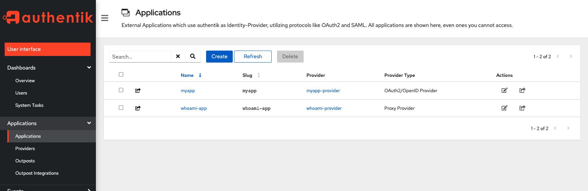
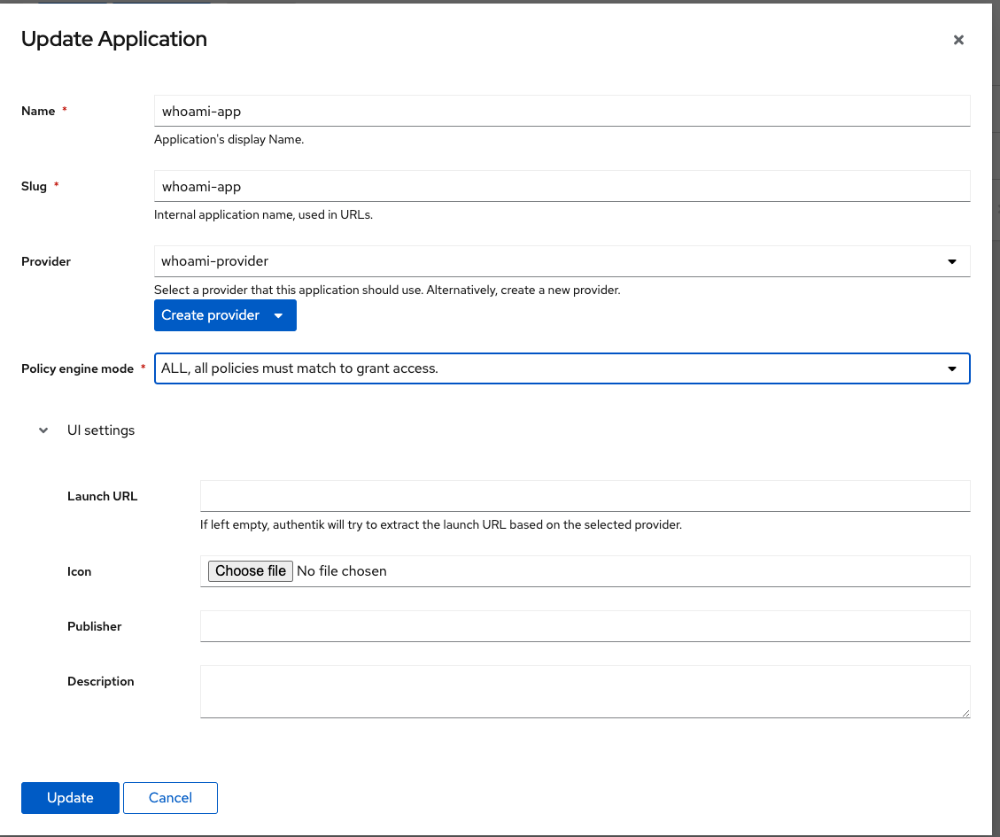
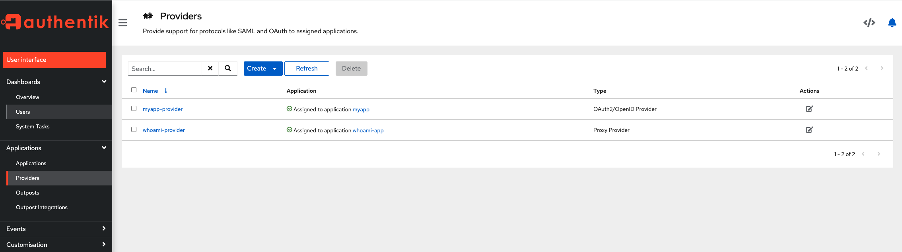
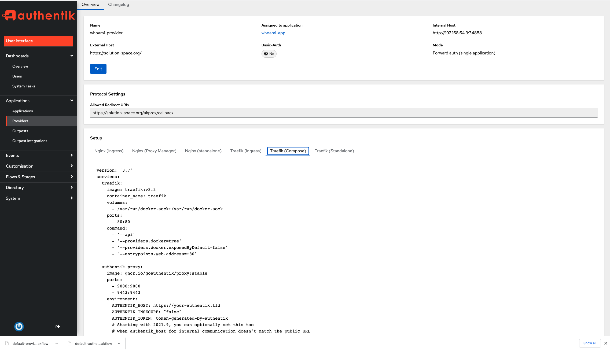
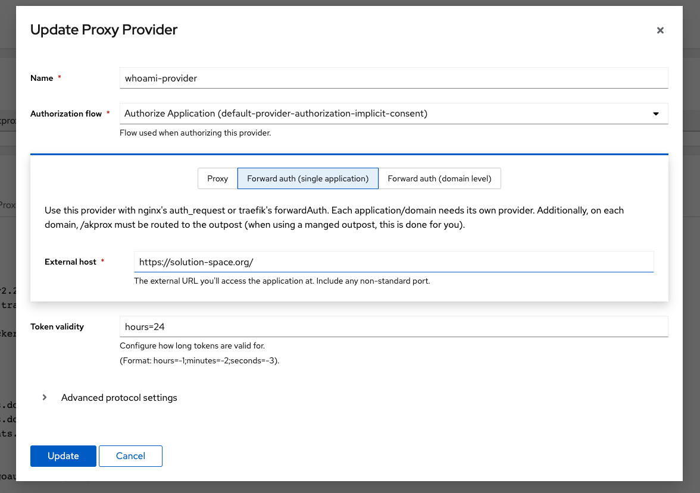
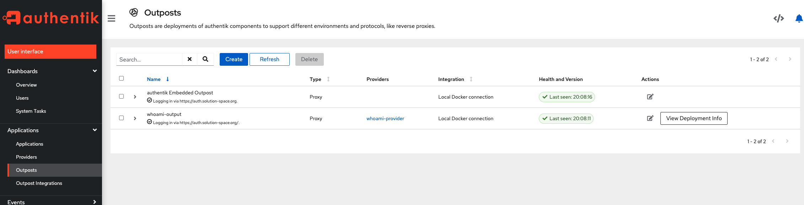
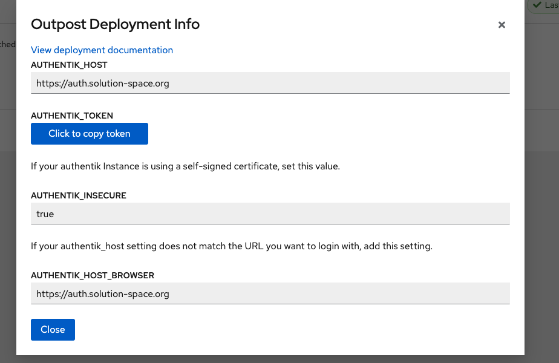

# Simple demo app

Idea is to protect whoami app with Authentik SSO. All containers are "behind" Treafik proxy which utilise letsencrypt service for SSL.

So, plan is, when i try to acceess https://solution-space.org (whoami app) i expect to be redirect to Authentik SSO Login page where i will type my credentials. 
I everything pass well (my credentials are good), i expect to be redirected to the site https://solution-space.org (whoami).


Start 
```
docker-compose up -d

#or 

make up
```


## STATUS: IN PROGRESS - HAVE ISSUE WITH PROXY SERVER CONFIGURATION

Main error: "Detected potential redirect loop" (authentik proxy) 


When i want to got to main app (hosted on domain : https://solution-space.org) i get the following issue in logs


__Treafik console output on startup__

```shell
traefik            | time="2022-01-24T19:29:46Z" level=info msg="Configuration loaded from flags."
traefik            | time="2022-01-24T19:29:46Z" level=info msg="Traefik version 2.5.6 built on 2021-12-22T16:30:52Z"
traefik            | time="2022-01-24T19:29:46Z" level=debug msg="Static configuration loaded {\"global\":{\"checkNewVersion\":true},\"serversTransport\":{\"maxIdleConnsPerHost\":200},\"entryPoints\":{\"websecure\":{\"address\":\":443\",\"transport\":{\"lifeCycle\":{\"graceTimeOut\":\"10s\"},\"respondingTimeouts\":{\"idleTimeout\":\"3m0s\"}},\"forwardedHeaders\":{},\"http\":{},\"udp\":{\"timeout\":\"3s\"}}},\"providers\":{\"providersThrottleDuration\":\"2s\",\"docker\":{\"watch\":true,\"endpoint\":\"unix:///var/run/docker.sock\",\"defaultRule\":\"Host(`{{ normalize .Name }}`)\",\"swarmModeRefreshSeconds\":\"15s\"}},\"api\":{\"dashboard\":true},\"log\":{\"level\":\"DEBUG\",\"format\":\"common\"},\"certificatesResolvers\":{\"myresolver\":{\"acme\":{\"email\":\"deba.pokus@gmail.com\",\"caServer\":\"https://acme-v02.api.letsencrypt.org/directory\",\"storage\":\"/letsencrypt/acme.json\",\"keyType\":\"RSA4096\",\"tlsChallenge\":{}}}},\"pilot\":{\"dashboard\":true}}"
traefik            | time="2022-01-24T19:29:46Z" level=info msg="\nStats collection is disabled.\nHelp us improve Traefik by turning this feature on :)\nMore details on: https://doc.traefik.io/traefik/contributing/data-collection/\n"
traefik            | time="2022-01-24T19:29:46Z" level=info msg="Starting provider aggregator.ProviderAggregator {}"
traefik            | time="2022-01-24T19:29:46Z" level=debug msg="Start TCP Server" entryPointName=websecure
traefik            | time="2022-01-24T19:29:46Z" level=info msg="Starting provider *traefik.Provider {}"
traefik            | time="2022-01-24T19:29:46Z" level=debug msg="Configuration received from provider internal: {\"http\":{\"services\":{\"api\":{},\"dashboard\":{},\"noop\":{}},\"serversTransports\":{\"default\":{\"maxIdleConnsPerHost\":200}}},\"tcp\":{},\"tls\":{}}" providerName=internal
traefik            | time="2022-01-24T19:29:46Z" level=info msg="Starting provider *docker.Provider {\"watch\":true,\"endpoint\":\"unix:///var/run/docker.sock\",\"defaultRule\":\"Host(`{{ normalize .Name }}`)\",\"swarmModeRefreshSeconds\":\"15s\"}"
traefik            | time="2022-01-24T19:29:46Z" level=info msg="Starting provider *acme.ChallengeTLSALPN {\"Timeout\":4000000000}"
traefik            | time="2022-01-24T19:29:46Z" level=info msg="Starting provider *acme.Provider {\"email\":\"deba.pokus@gmail.com\",\"caServer\":\"https://acme-v02.api.letsencrypt.org/directory\",\"storage\":\"/letsencrypt/acme.json\",\"keyType\":\"RSA4096\",\"tlsChallenge\":{},\"ResolverName\":\"myresolver\",\"store\":{},\"TLSChallengeProvider\":{\"Timeout\":4000000000},\"HTTPChallengeProvider\":{}}"
traefik            | time="2022-01-24T19:29:46Z" level=info msg="Testing certificate renew..." providerName=myresolver.acme
traefik            | time="2022-01-24T19:29:46Z" level=debug msg="No default certificate, generating one" tlsStoreName=default
traefik            | time="2022-01-24T19:29:46Z" level=debug msg="Configuration received from provider myresolver.acme: {\"http\":{},\"tls\":{}}" providerName=myresolver.acme
traefik            | time="2022-01-24T19:29:46Z" level=debug msg="Provider connection established with docker 20.10.12 (API 1.41)" providerName=docker
traefik            | time="2022-01-24T19:29:47Z" level=debug msg="http: panic serving 192.168.192.1:42816: runtime error: invalid memory address or nil pointer dereference"
traefik            | time="2022-01-24T19:29:47Z" level=debug msg="goroutine 51 [running]:"
traefik            | time="2022-01-24T19:29:47Z" level=debug msg="net/http.(*conn).serve.func1()"
traefik            | time="2022-01-24T19:29:47Z" level=debug msg="\t/usr/local/golang/1.10.8/go/src/net/http/server.go:1802 +0xb9"
traefik            | time="2022-01-24T19:29:47Z" level=debug msg="panic({0x2f2e900, 0x5c93640})"
traefik            | time="2022-01-24T19:29:47Z" level=debug msg="\t/usr/local/golang/1.10.8/go/src/runtime/panic.go:1047 +0x266"
traefik            | time="2022-01-24T19:29:47Z" level=debug msg="crypto/tls.(*Conn).readClientHello(0xc0000fe700, {0x3b648d8, 0xc000414f00})"
traefik            | time="2022-01-24T19:29:47Z" level=debug msg="\t/usr/local/golang/1.10.8/go/src/crypto/tls/handshake_server.go:144 +0x7e"
traefik            | time="2022-01-24T19:29:47Z" level=debug msg="crypto/tls.(*Conn).serverHandshake(0xc0000fe700, {0x3b648d8, 0xc000414f00})"
traefik            | time="2022-01-24T19:29:47Z" level=debug msg="\t/usr/local/golang/1.10.8/go/src/crypto/tls/handshake_server.go:43 +0x46"
traefik            | time="2022-01-24T19:29:47Z" level=debug msg="crypto/tls.(*Conn).handshakeContext(0xc0000fe700, {0x3b64980, 0xc0002e5a10})"
traefik            | time="2022-01-24T19:29:47Z" level=debug msg="\t/usr/local/golang/1.10.8/go/src/crypto/tls/conn.go:1445 +0x3d1"
traefik            | time="2022-01-24T19:29:47Z" level=debug msg="crypto/tls.(*Conn).HandshakeContext(...)"
traefik            | time="2022-01-24T19:29:47Z" level=debug msg="\t/usr/local/golang/1.10.8/go/src/crypto/tls/conn.go:1395"
traefik            | time="2022-01-24T19:29:47Z" level=debug msg="net/http.(*conn).serve(0xc0005e48c0, {0x3b64980, 0xc00064a5a0})"
traefik            | time="2022-01-24T19:29:47Z" level=debug msg="\t/usr/local/golang/1.10.8/go/src/net/http/server.go:1818 +0x230"
traefik            | time="2022-01-24T19:29:47Z" level=debug msg="created by net/http.(*Server).Serve"
traefik            | time="2022-01-24T19:29:47Z" level=debug msg="\t/usr/local/golang/1.10.8/go/src/net/http/server.go:3034 +0x4e8"
authentik-proxy_1  | {"error":"Get \"https://auth.solution-space.org/api/v3/outposts/instances/\": EOF","event":"Failed to fetch outpost configuration","level":"error","logger":"authentik.outpost.ak-api-controller","timestamp":"2022-01-24T19:29:47Z"}
traefik            | time="2022-01-24T19:29:47Z" level=debug msg="Filtering unhealthy or starting container" providerName=docker container=authentik-proxy-authentik-0f7afb5b23d4f728127fdbd3fee636834d1a0647889782f8d13c3201c98a58c9
traefik            | time="2022-01-24T19:29:47Z" level=debug msg="Filtering disabled container" providerName=docker container=worker-authentik-c8a0699a6dd4ec859db61efddee51e094b01df5de4705565ba09e23282d53fab
traefik            | time="2022-01-24T19:29:47Z" level=debug msg="Filtering unhealthy or starting container" providerName=docker container=server-authentik-993e65a79e7a05c5c267b161377dc0cf8b53b363801772c7f527381b1eb4e02a
traefik            | time="2022-01-24T19:29:47Z" level=debug msg="Filtering disabled container" container=redis-authentik-07aa7386a89d4490ac07fdc6ad5e017eaba5b1623cac97909be0ab5058d5aea1 providerName=docker
traefik            | time="2022-01-24T19:29:47Z" level=debug msg="Filtering disabled container" providerName=docker container=traefik-authentik-6044be1efe68339c1a2fa37cd9ff0f0d79150bd46acaa37e2c89949320996132
traefik            | time="2022-01-24T19:29:47Z" level=debug msg="Filtering disabled container" providerName=docker container=postgresql-authentik-897a6b4ed473ee0c9d2ab5e894326b1dd27e1bf2bc9d6104b7d97ea35c700a65
traefik            | time="2022-01-24T19:29:47Z" level=debug msg="Configuration received from provider docker: {\"http\":{\"routers\":{\"whoami_domain\":{\"entryPoints\":[\"websecure\"],\"middlewares\":[\"authentik@docker\"],\"service\":\"whoami-domain-authentik\",\"rule\":\"Host(`solution-space.org`)\",\"tls\":{\"certResolver\":\"myresolver\"}}},\"services\":{\"whoami-domain-authentik\":{\"loadBalancer\":{\"servers\":[{\"url\":\"http://192.168.192.2:80\"}],\"passHostHeader\":true}}}},\"tcp\":{},\"udp\":{}}" providerName=docker
server_1           | {"event": "Loaded config", "level": "debug", "logger": "authentik.lib.config", "timestamp": 1643052587.8913355, "file": "/authentik/lib/default.yml"}
server_1           | {"event": "Loaded environment variables", "level": "debug", "logger": "authentik.lib.config", "timestamp": 1643052587.8916821, "count": 9}
traefik            | time="2022-01-24T19:29:48Z" level=debug msg="No default certificate, generating one" tlsStoreName=default
server_1           | 2022-01-24 19:29.48 [info     ] applying django migrations
server_1           | 2022-01-24 19:29.48 [info     ] waiting to acquire database lock
traefik            | time="2022-01-24T19:29:49Z" level=debug msg="Provider event received {Status:start ID:0f7afb5b23d4f728127fdbd3fee636834d1a0647889782f8d13c3201c98a58c9 From:ghcr.io/goauthentik/proxy:stable Type:container Action:start Actor:{ID:0f7afb5b23d4f728127fdbd3fee636834d1a0647889782f8d13c3201c98a58c9 Attributes:map[com.docker.compose.config-hash:0cb06ee606be14c33ffd05c9f7e5e299216e78eb55b611a6366745f35711497b com.docker.compose.container-number:1 com.docker.compose.oneoff:False com.docker.compose.project:authentik com.docker.compose.project.config_files:docker-compose.yml com.docker.compose.project.working_dir:/home/deba/development/authentik com.docker.compose.service:authentik-proxy com.docker.compose.version:1.25.0 image:ghcr.io/goauthentik/proxy:stable name:authentik_authentik-proxy_1 org.opencontainers.image.description:goauthentik.io Proxy outpost image, see https://goauthentik.io for more info. org.opencontainers.image.source:https://github.com/goauthentik/authentik org.opencontainers.image.url:https://goauthentik.io traefik.enable:True traefik.http.middlewares.authentik.forwardauth.address:http://authentik-proxy:9000/akprox/auth/traefik traefik.http.middlewares.authentik.forwardauth.authResponseHeaders:X-authentik-username,X-authentik-groups,X-authentik-email,X-authentik-name,X-authentik-uid,X-authentik-jwt,X-authentik-meta-jwks,X-authentik-meta-outpost,X-authentik-meta-provider,X-authentik-meta-app,X-authentik-meta-version traefik.http.middlewares.authentik.forwardauth.trustForwardHeader:True traefik.http.routers.authentik.rule:Host(`https://solution-space.org/`) && PathPrefix(`/akprox/`) traefik.port:9000]} Scope:local Time:1643052589 TimeNano:1643052589293846669}" providerName=docker
traefik            | time="2022-01-24T19:29:49Z" level=debug msg="Serving default certificate for request: \"auth.solution-space.org\""

```

__When i try to load my page in browser i get the following error__

```shell
authentik-proxy_1  | {"event":"/akprox/auth/traefik","host":"solution-space.org","level":"info","logger":"authentik.outpost.proxyv2.application","method":"GET","name":"whoami-provider","remote":"192.168.176.6:60102","request_protocol":"HTTP/1.1","request_useragent":"Mozilla/5.0 (Macintosh; Intel Mac OS X 10_15_6) AppleWebKit/537.36 (KHTML, like Gecko) Chrome/97.0.4692.71 Safari/537.36","runtime":"4.697","size":75,"status":307,"timestamp":"2022-01-24T18:35:51Z","upstream":""}
traefik            | time="2022-01-24T18:35:51Z" level=debug msg="Remote error http://authentik-proxy:9000/akprox/auth/traefik. StatusCode: 307" middlewareName=authentik@docker middlewareType=ForwardedAuthType
authentik-proxy_1  | {"event":"Detected potential redirect loop","level":"info","logger":"authentik.outpost.proxy.bundle","provider":"whoami-provider","timestamp":"2022-01-24T18:35:51Z"}
authentik-proxy_1  | {"event":"/akprox/auth/traefik","host":"solution-space.org","level":"info","logger":"authentik.outpost.proxyv2.application","method":"GET","name":"whoami-provider","remote":"192.168.176.6:60102","request_protocol":"HTTP/1.1","request_useragent":"Mozilla/5.0 (Macintosh; Intel Mac OS X 10_15_6) AppleWebKit/537.36 (KHTML, like Gecko) Chrome/97.0.4692.71 Safari/537.36","runtime":"2.765","size":75,"status":307,"timestamp":"2022-01-24T18:35:51Z","upstream":""}
traefik            | time="2022-01-24T18:35:51Z" level=debug msg="Remote error http://authentik-proxy:9000/akprox/auth/traefik. StatusCode: 307" middlewareType=ForwardedAuthType middlewareName=authentik@docker
authentik-proxy_1  | {"event":"Detected potential redirect loop","level":"info","logger":"authentik.outpost.proxy.bundle","provider":"whoami-provider","timestamp":"2022-01-24T18:35:51Z"}
authentik-proxy_1  | {"event":"/akprox/auth/traefik","host":"solution-space.org","level":"info","logger":"authentik.outpost.proxyv2.application","method":"GET","name":"whoami-provider","remote":"192.168.176.6:60102","request_protocol":"HTTP/1.1","request_useragent":"Mozilla/5.0 (Macintosh; Intel Mac OS X 10_15_6) AppleWebKit/537.36 (KHTML, like Gecko) Chrome/97.0.4692.71 Safari/537.36","runtime":"2.033","size":75,"status":307,"timestamp":"2022-01-24T18:35:51Z","upstream":""}

...
```


## Authentik configuration 

Applications:



Application config (whoami):



Providers configuration:




Whoami provider:



Provider details:




Outputs:



Output details:

